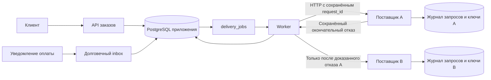

# Digital Goods Core

Ядро продажи цифровых товаров: создание заказа, приём уведомления об оплате и фоновая выдача одного ключа через двух HTTP-поставщиков. Реализация на PHP 8.2+, PDO/cURL и PostgreSQL 16+; поставщики — отдельные процессы с собственным журналом запросов и запасом синтетических ключей.

Главное условие: повторная доставка сообщения, конкурентные worker-процессы и потерянный HTTP-ответ не должны приводить к повторной покупке ключа. Для этого приложение сохраняет попытку **до** HTTP-вызова и при неизвестном результате повторяет её с теми же поставщиком и `request_id`.

## Пять этапов задания

| Этап | Что реализовано | Где смотреть |
|---|---|---|
| 1. Заказ и оплата | Создание по SKU, цена из каталога, чтение заказа, webhook оплаты, состояния заказа | `src/Domain/OrderService.php`, `src/Domain/PaymentService.php`, `public/index.php` |
| 2. Повторы и конкурентность | Дедупликация по `event_id`, конфликт содержимого события, ранние уведомления, блокировки, одна задача выдачи | `payment_events`, `delivery_jobs`, интеграционные тесты |
| 3. Поставщики и восстановление | Два реальных HTTP-сервиса, безопасный переход A → B, неопределённые результаты, backoff, перезапуск и пополнение остатка | `src/Supplier/`, `src/Delivery/` |
| 4. Денежный журнал | Двойная запись при оплате и выдаче, ограничения БД, внутренняя сверка и восстановление очереди | `src/Infrastructure/Ledger.php`, `src/Domain/ReconciliationService.php` |
| 5. Каталог и нагрузка | Фильтрация, сортировка с устойчивым порядком, пагинация по курсору, частичные индексы и воспроизводимый `EXPLAIN ANALYZE` на 20 000 SKU | `src/Domain/CatalogService.php`, `database/001_init.sql`, `catalog:benchmark` |

Разбиение работы между агентами, зависимости и оценка трудозатрат — в [плане выполнения](docs/IMPLEMENTATION_PLAN.md). Подробное обоснование гарантий и компромиссов — в [инженерных решениях](docs/DECISIONS.md).

## Запуск

Нужны Docker и Docker Compose v2. Все команды ниже выполняются из корня репозитория.

```sh
docker compose up --build -d
curl --fail-with-body http://127.0.0.1:8080/health
docker compose run --rm app php bin/console demo
```

Первый запуск поднимает PostgreSQL, API, двух поставщиков и фоновый worker. `demo` создаёт демонстрационный заказ и эмулирует оплату. Выдача выполняется отдельно worker-процессом. API доступен на `127.0.0.1:8080`; демонстрационный порт привязан к localhost.

Образ использует PHP 8.3; минимальная поддерживаемая версия кода — 8.2. Встроенный HTTP-сервер PHP запущен с несколькими процессами, чтобы воспроизводить конкурентные запросы; для публичной эксплуатации нужен обычный серверный стек, например PHP-FPM. Значения Compose можно переопределить через `.env` по примеру [.env.example](.env.example).

| Настройка Compose | По умолчанию | Назначение |
|---|---|---|
| `API_PORT` | `8080` | Порт API на localhost |
| `DB_PASSWORD` | Демонстрационный пароль из Compose | Пароль локальной БД, без реальных учётных данных |
| `SUPPLIER_TIMEOUT_MS` | `300` | Общий таймаут HTTP-вызова поставщика |
| `BACKOFF_BASE_MS` | `200` | Начальная задержка повторов |
| `BACKOFF_MAX_MS` | `30000` | Максимальная задержка повторов |

```sh
docker compose logs -f api worker
docker compose down
```

Обычный `down` сохраняет данные PostgreSQL. Ключи в начальных данных синтетические. Они расходуются при выдаче; повторные демонстрации могут потребовать пополнения.

## API на примере заказа

Создать заказ на товар из начальных данных:

```sh
curl --fail-with-body -X POST http://127.0.0.1:8080/orders \
  -H 'Content-Type: application/json' \
  --data '{"order_id":"example-order-001","sku":"STEAM-TOPUP-500"}'
```

Пример ответа до оплаты:

```json
{
  "order_id": "example-order-001",
  "sku": "STEAM-TOPUP-500",
  "status": "created",
  "amount": "500.00",
  "amount_minor": 50000,
  "currency": "RUB",
  "paid_at": null,
  "delivery": null
}
```

При первом создании сервер возвращает `201` и `Location`. Повтор того же `order_id` с тем же SKU возвращает существующий заказ и `200`, даже если цена каталога уже изменилась. Другой SKU с занятым `order_id` даёт `409`. Без `order_id` сервер генерирует идентификатор; для безопасного повтора создания после сетевой ошибки клиент должен передавать собственный стабильный `order_id`.

Цена и валюта фиксируются из каталога при создании. Переданные клиентом дополнительные поля цены не меняют стоимость заказа.

Эмулировать уведомление платёжной системы:

```sh
curl --fail-with-body -X POST http://127.0.0.1:8080/webhook/payment \
  -H 'Content-Type: application/json' \
  --data '{
    "event_id":"example-event-001",
    "order_id":"example-order-001",
    "status":"paid",
    "amount":"500.00",
    "currency":"RUB",
    "created_at":"2026-09-08T12:00:00Z"
  }'
```

`200` означает, что результат обработки уведомления надёжно записан. Это не обещание немедленной выдачи ключа. Повтор идентичного события возвращает `outcome: duplicate`; повтор `event_id` с другим значимым содержимым — `409`.

Проверить заказ:

```sh
curl --fail-with-body http://127.0.0.1:8080/orders/example-order-001
```

После успешной выдачи `status` станет `delivered`, а `delivery` будет содержать `provider`, `request_id` и `code`. Ответы запрещают кеширование через `Cache-Control: no-store`. Не публикуйте ответы с реальными кодами доступа.

Обычный путь состояния: `created` → `paid` → `delivering` → `delivered`. `payment_failed` относится к неоплаченному заказу; `delivery_failed` и `out_of_stock` сохраняют факт оплаты и допускают продолжение выдачи.

| Метод и маршрут | Назначение |
|---|---|
| `POST /orders` | Создать или повторно получить заказ по `order_id` и SKU |
| `GET /orders/{id}` | Прочитать состояние и результат выдачи |
| `POST /webhook/payment` | Принять уведомление `paid` или `failed` |
| `POST /webhooks/payment` | Совместимый альтернативный путь того же webhook |
| `GET /catalog` | Получить доступные товары с пагинацией |
| `GET /health` | Проверить подключение к PostgreSQL |

Служебные операции восстановления, управления поставщиками и произвольного SQL доступны только через CLI.

### Формат и ошибки

- POST принимает объект JSON с `Content-Type: application/json`, размером до 64 КиБ. Массив вместо объекта и повторяющиеся поля верхнего уровня отклоняются.
- `order_id`, `event_id` и SKU: 1–128 символов; первая буква или цифра, далее допустимы ASCII-буквы, цифры, `.`, `_`, `:`, `-`.
- `amount` — положительная сумма в основных единицах, числом JSON или десятичной строкой, максимум два знака после точки. Экспоненциальная запись, отрицательные и нулевые суммы не поддерживаются. Например, `500`, `500.0` и `"500.00"` эквивалентны.
- В БД деньги хранятся целыми копейками в `bigint`. Верхняя граница — `92233720368547758.07` основных единиц. В ответах `amount` всегда строка, а `amount_minor` — целое число. Клиентам с ограничением точности JSON-чисел следует использовать `amount`.
- Исходная запись JSON-суммы сохраняется при разборе: `1.0000000000000001` отклоняется, а не округляется до `1.00`.
- `currency` — три заглавные ASCII-буквы. Сумма и валюта события должны совпасть с сохранённым заказом.
- `created_at` требует ISO8601 с часовым поясом, например `2026-09-08T17:00:00+05:00`; допускается до шести дробных знаков секунды. Эквивалентные часовые пояса нормализуются в UTC.

| HTTP | Причина |
|---|---|
| `400` | Некорректный JSON |
| `404` | Неизвестный заказ, товар или маршрут |
| `405` | Неподдерживаемый метод; допустимый указан в `Allow` |
| `409` | Конфликт `order_id` или содержимого `event_id` |
| `413` | Превышен размер тела |
| `415` | Неподходящий `Content-Type` |
| `422` | Невалидные поля или формат данных |
| `503` | `/health` не смог обратиться к БД |
| `500` | Внутренняя ошибка; детали и секреты не возвращаются клиенту |

Корректно оформленное событие с неверной суммой или валютой записывается как `rejected`, не создаёт оплату и получает HTTP `200` с `outcome: rejected`. Неизвестный заказ получает `outcome: pending`: уведомление сохраняется и будет проверено при создании этого заказа.

### Порядок событий оплаты

Подтверждённая совпадающей суммой и валютой оплата считается необратимым фактом в рамках этого задания. `failed` переводит неоплаченный заказ в `payment_failed`; последующее корректное `paid` может его оплатить. После `paid` никакое `failed`, независимо от `created_at`, не отменяет оплату или доставку. Возврат платежа должен быть отдельной бизнес-операцией и здесь не реализован.

## Выдача и граница гарантий



Поставщики работают отдельными HTTP-процессами и используют отдельные подключения. В демонстрации их таблицы расположены в схеме `supplier` того же PostgreSQL. Рабочий алгоритм выдачи не читает эти таблицы напрямую и не объединяет локальную фиксацию с фиксацией поставщика в одну транзакцию.

| Ситуация | Действие worker |
|---|---|
| Успех с совпавшими поставщиком и `request_id` | Атомарно сохранить ключ, `delivered`, проводки и удалить задачу |
| A сохранил окончательный отказ | Зафиксировать отказ A и новую попытку B до её отправки |
| Оба поставщика окончательно отказали из-за остатка | `out_of_stock`, сохранить задачу и повторить новый безопасный цикл после backoff |
| Оба окончательно отказали по другим причинам | `delivery_failed`, сохранить задачу и повторить цикл после backoff |
| Таймаут, разрыв соединения, неизвестный 5xx, неверный JSON/идентификатор | `delivery_failed` и неоднозначная попытка; повторять тот же `request_id` у того же поставщика |
| Процесс упал после записи попытки | Продолжить сохранённую попытку с прежними идентификаторами |

Даже ошибка подключения сохраняет привязку к поставщику: ранее этот же запрос мог уйти из другого процесса, который затем упал. Поэтому отключённый сетевой порт A не равнозначен протокольному ответу `unavailable`. При длительной недоступности A неопределённый заказ может ждать его восстановления, несмотря на работоспособный B.

HTTP-вызовы и задачи допускают повторы. Однократный бизнес-эффект обеспечивается при условии, что поставщик сохраняет результат по `request_id`, не выдаёт второй ключ для повторного запроса и соблюдает окончательность отказов. Это условная гарантия протокола, а не универсальная гарантия «exactly once» для произвольного стороннего API. Подробнее — [решения и окна падения](docs/DECISIONS.md).

## Воспроизведение отказов

Настройки меняют поведение **новых** запросов. Уже сохранённый ответ поставщика остаётся прежним при любом последующем изменении режима.

```sh
# A отвечает сохранённым окончательным отказом; новый заказ может получить ключ у B.
docker compose run --rm app php bin/console supplier:mode A unavailable
docker compose run --rm app php bin/console demo

# A фиксирует выдачу, затем задерживает ответ дольше клиентского таймаута.
docker compose run --rm app php bin/console supplier:mode A timeout_after_issue
docker compose run --rm app php bin/console demo

# Реально задержать обработку до выдачи: поздний запрос остаётся возможным.
docker compose run --rm app php bin/console supplier:mode A timeout_before_issue
docker compose run --rm app php bin/console demo

# 20% окончательных отказов, 30% таймаутов после выдачи для новых запросов.
docker compose run --rm app php bin/console supplier:mode A random 0.2 0.3

# Вернуть обычную работу и ускорить восстановление ожидающих заказов.
docker compose run --rm app php bin/console supplier:mode A normal
docker compose run --rm app php bin/console supplier:mode B normal
docker compose run --rm app php bin/console recover
```

Режим `out_of_stock` принудительно моделирует отсутствие товара. Реальный пустой пул ключей даёт такой же окончательный отказ. Для пополнения:

```sh
docker compose run --rm app php bin/console supplier:restock A STEAM-TOPUP-500 10
docker compose run --rm app php bin/console supplier:mode A normal
docker compose run --rm app php bin/console recover
```

`recover` создаёт отсутствующие задачи для оплаченных невыданных заказов и ускоряет существующие, обрабатывая до 500 заказов за вызов. Он сохраняет прежний `request_id` активной попытки; повторно оплачивать заказ не требуется. Новый `request_id` допустим только после окончательных отказов предыдущего цикла. Непрерывный worker каждые 30 секунд также восстанавливает потерянные задачи, сохраняя backoff уже существующих.

Backoff экспоненциальный и ограничен сверху; по умолчанию базовая задержка — 200 мс, максимальная — 30 секунд. Лимита количества повторов нет: после пополнения или восстановления поставщика заказ остаётся доступным для продолжения.

## Проверки

```sh
docker compose --profile test run --rm tests
```

Профиль тестирования использует отдельные PostgreSQL, API и поставщиков. Непрерывный worker в этом окружении не запускается: тесты сами создают worker-процессы, управляют моментами вызовов и проверяют гонки. Демонстрационные данные основного окружения не используются. SQL-контроль тестового стенда разрешён только при `APP_ENV=test` и не доступен по HTTP.

Набор проверяет 50 параллельных одинаковых событий, 50 разных событий одного заказа, гонки оплаты и создания, ранние и переставленные события, точность денег, два вида таймаута, безопасный переход к B, исчерпание и пополнение остатка, конкурентные worker-процессы, восстановление потерянной задачи и состояния в окнах падения. Проверяются не только статусы заказа, но и фактическое число выдач и списанных ключей у поставщиков.

```sh
docker compose --profile test run --rm -e RUN_RANDOM_TESTS=1 tests
```

Дополнительный случайный сценарий использует настраиваемые вероятности отказов, затем восстанавливает обычную работу и проверяет инварианты. Детерминированные сценарии остаются основой приёмки. Подробности, ограничения и точечный перезапуск — в [tests/README.md](tests/README.md). Фактические результаты определяются выводом запуска; число сценариев и время печатает `unittest`.

Отдельно воспроизвести приёмочные сценарии с автоматической проверкой результата:

```sh
# Два случая по 50 параллельных вебхуков.
docker compose --profile test run --rm tests sh scripts/test.sh -k fifty
# A возвращает окончательный отказ; B выдаёт единственный ключ.
docker compose --profile test run --rm tests sh scripts/test.sh -k definitive_unavailability
# Таймаут после фактической выдачи; повтор сохраняет request_id и код.
docker compose --profile test run --rm tests sh scripts/test.sh -k timeout_after_issue
# Принудительное завершение worker после фиксации выдачи поставщиком.
docker compose --profile test run --rm tests sh scripts/test.sh -k killed_worker
```

Зафиксированный локальный результат: **28 тестов пройдены за 30,404 с**, включая случайные отказы и реальное завершение worker сигналом SIGKILL. Сверка после прогона не обнаружила оплаченных невыданных заказов, выдач без оплаты или расхождений журнала. Окружение, замеры и фактический срок — в [отчёте проверки](docs/VALIDATION.md); план каталога сохранён в [BENCHMARK.json](docs/BENCHMARK.json).

## Денежный журнал и сверка

```sh
docker compose run --rm app php bin/console reconcile
docker compose run --rm app php bin/console recover
```

| Событие | Проводки в копейках для заказа стоимостью `M` |
|---|---|
| Оплата | `cash: +M`, `customer_liability: -M` |
| Выдача | `customer_liability: +M`, `revenue: -M` |

Уникальность `(order_id, kind)` не позволяет повторить денежный эффект. Отложенное ограничение PostgreSQL на `COMMIT` проверяет две правильные проводки, нулевую сумму, валюту и сумму заказа. Журнал и сохранённые выдачи защищены от изменения и удаления триггерами. Неоплаченный заказ нельзя выдать через рабочий алгоритм.

`reconcile` выполняет внутреннюю сверку заказов, выдач, задач и проводок. Она помогает найти оплаченный заказ без выдачи или задачи и нарушения учёта. Это не сверка с банковской выпиской или API реального платёжного провайдера. `recover` восстанавливает очередь, не создавая оплат или ключей из предположений.

В JSON-отчёте есть `paid_not_delivered`, `delivered_not_paid`, `pending_events` и `ledger`, включая `balanced`, `missing_postings`, счета и баланс по валютам. Новый оплаченный заказ до завершения worker закономерно входит в `paid_not_delivered`; для диагностики важны возраст, последняя ошибка и время следующей попытки. Отчёт читается в одной транзакции с согласованным снимком данных.

## Каталог и масштабирование

```sh
curl --fail-with-body 'http://127.0.0.1:8080/catalog?type=key&limit=50'
curl --fail-with-body 'http://127.0.0.1:8080/catalog?type=key&limit=50&after_price=50000&after_sku=EXAMPLE-SKU'
docker compose run --rm app php bin/console catalog:benchmark
```

Каталог выбирает активные товары с положительным `available_stock` и сортирует по `(price_minor, sku)`. `after_price` передаётся в копейках вместе с `after_sku`; используйте значения последнего товара предыдущей страницы. Пара SKU и цены задаёт устойчивый порядок при одинаковых ценах и позволяет продолжать страницу без большого `OFFSET`.

Ответ содержит `items` и `next_cursor`; когда продолжения нет, курсор равен `null`. У товара есть `sku`, `name`, `type`, `price` (строка основных единиц), `price_minor` (целое), `currency`, `available_stock`. Допустимые типы — `key`, `topup`, `subscription`, `giftcard`; `limit` от 1 до 100, по умолчанию 50. Для следующей страницы передайте поля `next_cursor` вместе с прежним фильтром.

Частичные индексы `(type, price_minor, sku)` и `(price_minor, sku)` соответствуют вариантам запроса с фильтром по типу и без него. Поля ответа добавлены через `INCLUDE`. Команда `catalog:benchmark` добавляет 20 000 синтетических SKU внутри транзакции, обновляет статистику и выводит `EXPLAIN (ANALYZE, BUFFERS, FORMAT JSON)` для первой страницы и страницы с курсором. Затем синтетические строки откатываются; ранее сохранённый каталог остаётся на месте. Итоговое количество строк включает исходные товары, а время и выбранный план зависят от данных, статистики и окружения.

Остаток в каталоге — подсказка доступности, а не резервирование. Между показом каталога, оплатой и выдачей ключи могут закончиться. Источник истины для конкретной выдачи — поставщик, который атомарно выбирает свободный ключ. Успешная локальная выдача уменьшает подсказку остатка один раз.

API масштабируется отдельными процессами; обработку выдач можно распараллелить несколькими worker-процессами. Каждый worker использует выделенное соединение с PostgreSQL и блокирует конкретный заказ, а не всю очередь. SQL-транзакция не остаётся открытой во время HTTP-вызова. Для session advisory locks нужен прямой доступ к PostgreSQL или session pooling; **PgBouncer в режиме transaction pooling не поддерживается**.

Backoff уже использует equal jitter: случайную задержку от 50% до 100% ограниченной экспоненциальной границы. Для большой очереди следующий шаг — ограничение запросов к каждому поставщику, метрики возраста задач и разбиение очереди. Для большого каталога — измерение на реальном распределении данных, обновление статистики и отдельное решение о свежести остатков.

## Область применения

Это тестовое ядро, а не готовый публичный платёжный сервис. В объём задания не входят авторизация пользователя, проверка подписи webhook, реальное списание средств, возвраты, шифрование цифровых кодов и промышленное управление секретами. В демонстрации уведомление считается доверенным после проверки формата и совпадения суммы/валюты. Публиковать такой webhook и выдачу ключей в интернет без добавления этих механизмов нельзя.

Общая СУБД и учётные данные демонстрации упрощают локальный запуск, но не создают границу доступа между приложением и поставщиком. В рабочей интеграции нужны отдельные сервисные учётные записи, сетевые границы и согласованный срок хранения идемпотентных результатов поставщика. При утрате журнала попыток или нарушении поставщиком контракта текущая гарантия однократной выдачи перестаёт действовать.
